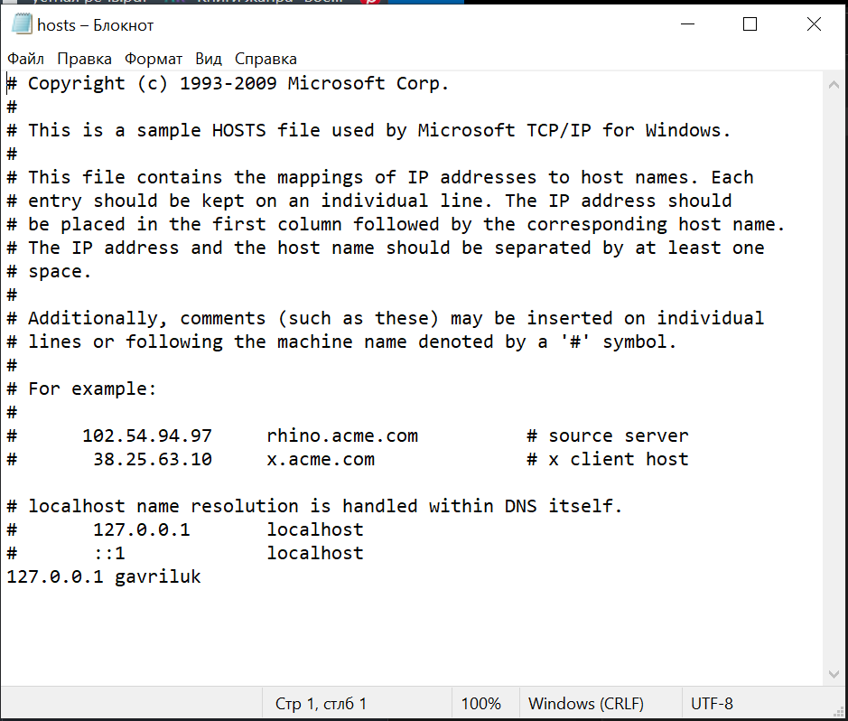
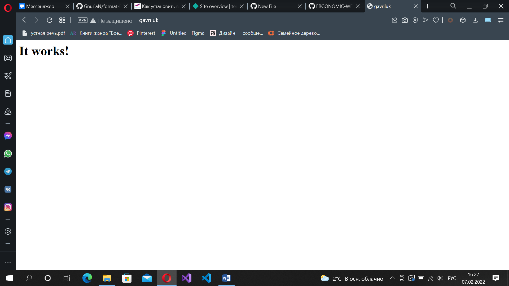
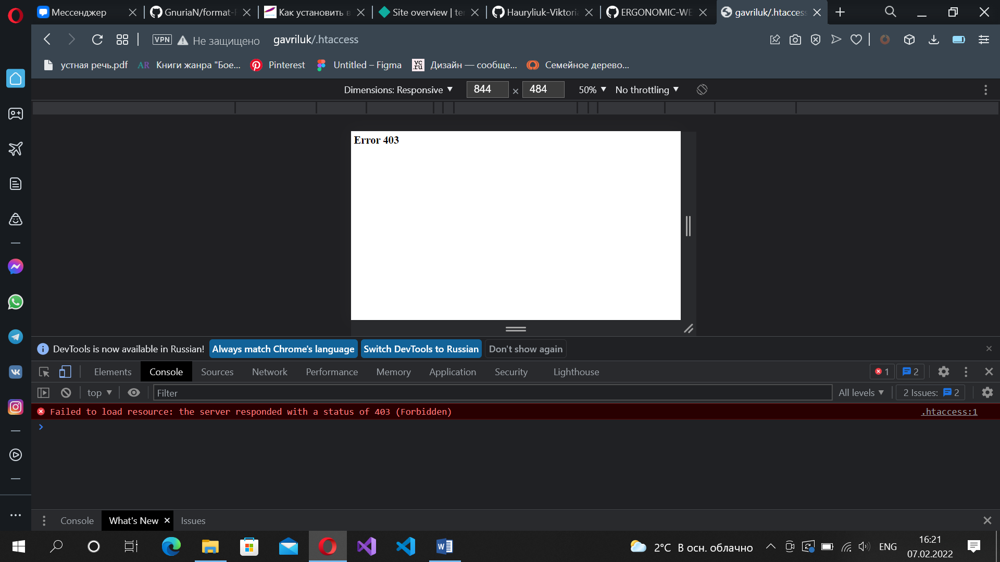
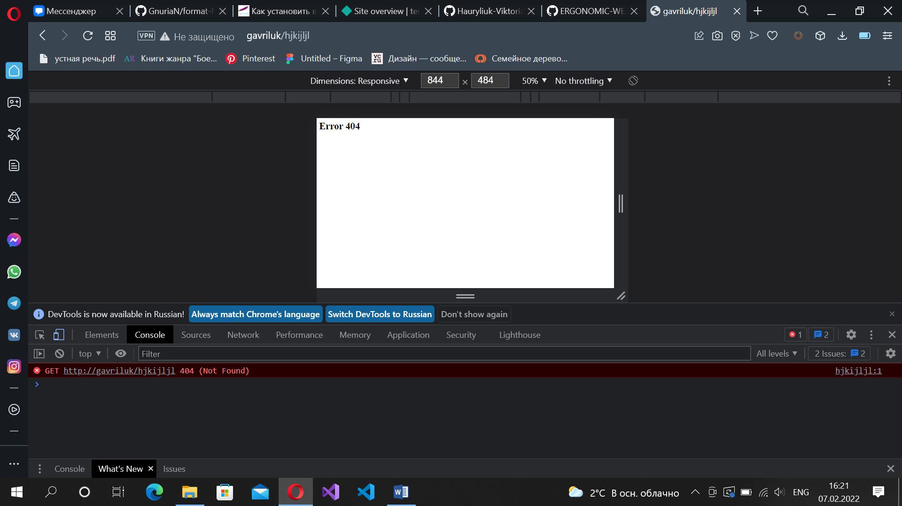

# Базовая настройка сервера
___________________________
:white_check_mark: Был скачан и установлен Apache

:white_check_mark: Добавлен хост, соответствующий фамилии



:white_check_mark: Были созданы 3 страницы: основная, с закрытым доступом и на случай попытки доступа к несуществующей

* Основная:



* С закрытым доступом:

```
ErrorDocument 404 /404.html
ErrorDocument 403 /403.html

RewriteEngine On
RewriteRule ^/.htaccess /403.html
```



* При попытке открыть несуществующую:


